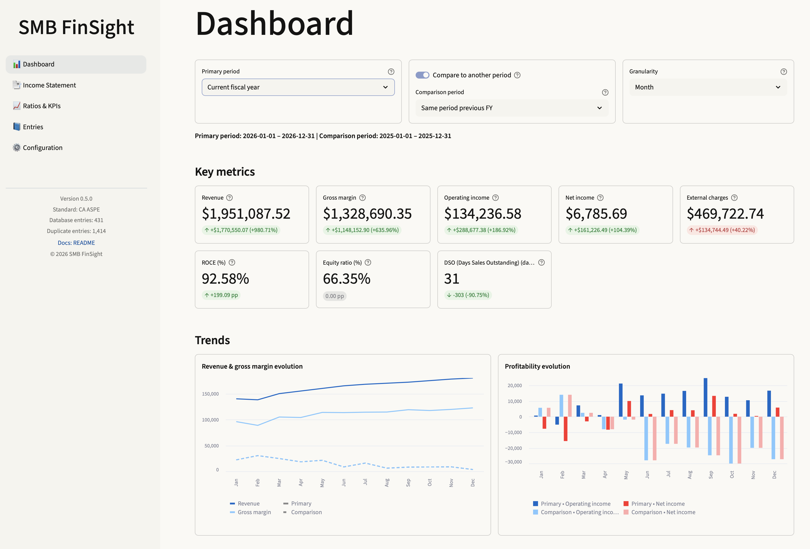
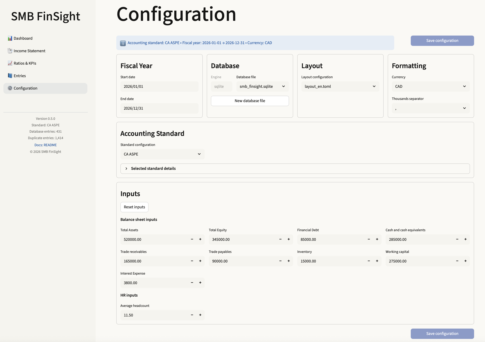
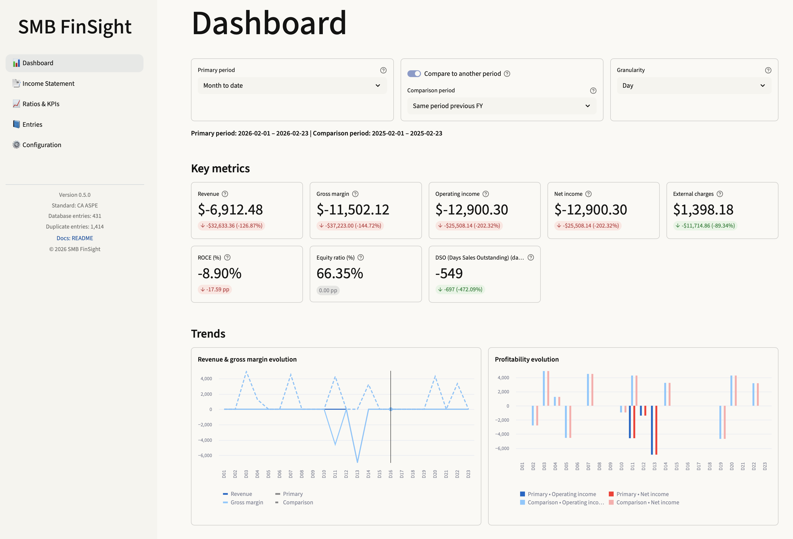
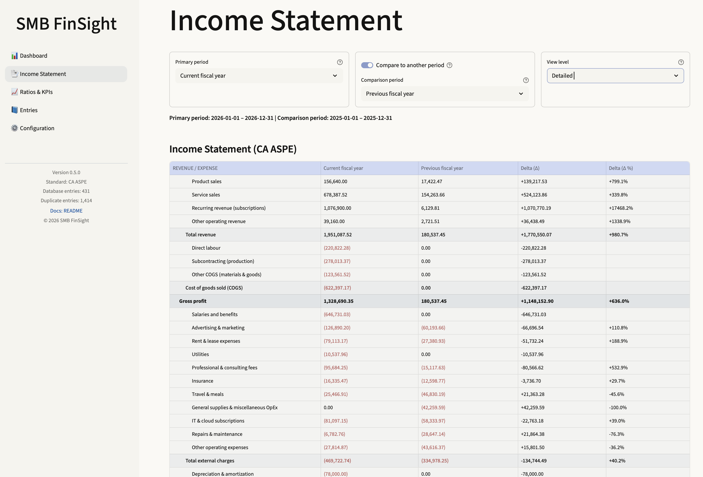
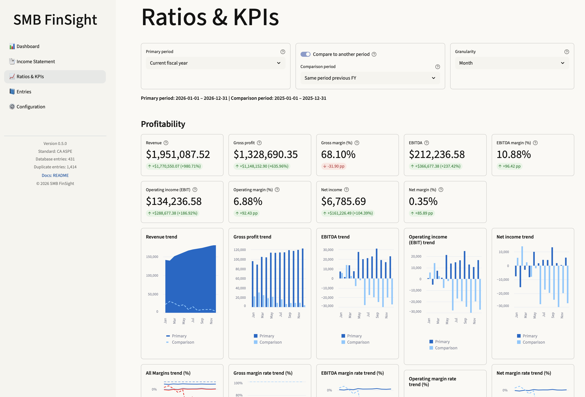
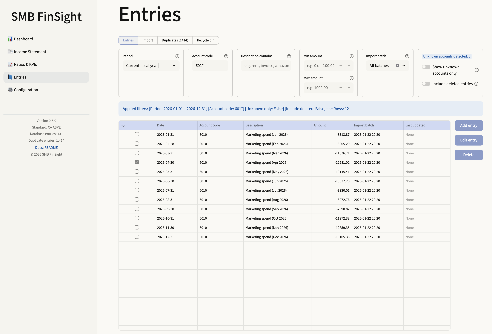
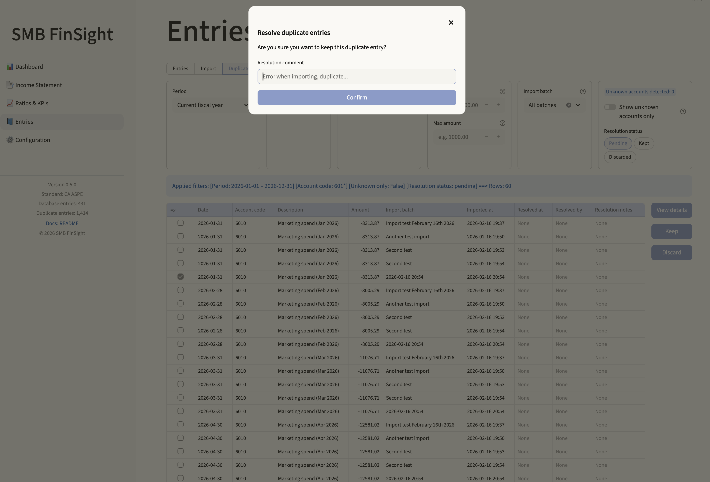
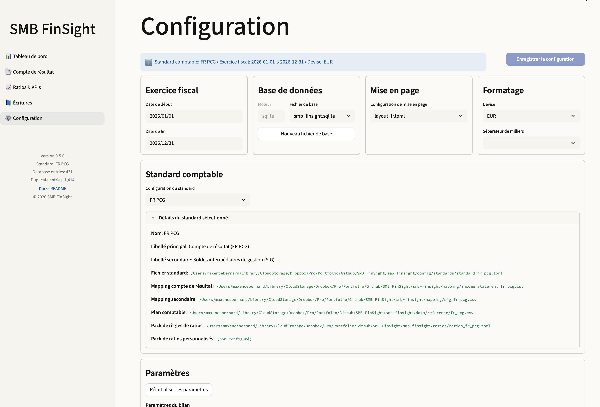
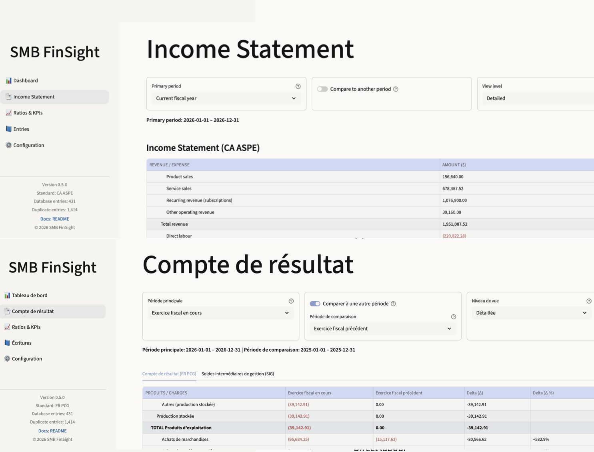

# 🧾 SMB FinSight


[](https://github.com/maxencebernardhub/smb-finsight/releases)

**SMB FinSight** is a Python-based financial dashboard & analytics application designed for **small and medium-sized businesses**.  
It converts raw accounting entries stored in the local database (typically fed via CSV imports) into **standardized financial statements**, **KPIs** and **charts**, using fully configurable, standard-specific mapping rules (French PCG, Canadian ASPE, US GAAP and IFRS).


*Dashboard overview with period selection and KPI deltas (Web UI v0.5.0).*

The application supports:
- multi-standard accounting (FR PCG, CA ASPE, US GAAP and IFRS)
- normalized income statement generation (simplified → complete)
- optional secondary statements (e.g., French SIG)
- a unified financial-ratio engine
- a unified multi-period computation engine generating statements, measures (canonical, extra and derived) and ratios for any number of periods in a single pass (Python API)
- flexible period selection (FY, YTD, MTD, last-month, custom)
- CSV imports

SMB FinSight includes:
- a **Streamlit Web UI** (recommended for day-to-day use)
- a **CLI** (power-user / automation / developer workflows)
- a **Python API** for programmatic multi-period computations

Note: the CLI remains single-period only. Multi-period analysis is available through the Python API and the Web UI.

Since **v0.3.0**, SMB FinSight uses a local SQLite database as the single source of truth for all accounting entries.
**v0.4.0+** introduced full CRUD operations, and **v0.4.5** added a complete duplicate-resolution workflow.

As of **v0.5.0**, SMB FinSight includes a full Streamlit Web UI.

💡 Ideal for freelancers, entrepreneurs, CFOs, analysts, and accountants who want **clean, reproducible financial statements, KPIs and charts** without relying on heavy accounting software.

---

## 📚 Table of Contents

- [Main Features](#️-main-features)
- [Supported Accounting Standards](#-supported-accounting-standards)
- [Project Structure](#-project-structure-updated-for-v050)
- [Installation](#-installation)
- [Quick Start (Web UI)](#-quick-start-web-ui)
- [Web UI Guide](#-web-ui-guide)
  - [Dashboard](#dashboard)
  - [Income Statement](#income-statement)
  - [Ratios & KPIs](#ratios--kpis)
  - [Entries, Import & Duplicates](#entries-import--duplicates)
  - [Configuration Page](#configuration-page)
  - [Layouts & Languages](#layouts--languages)
- [Configuration (Files)](#configuration-files)
- [CLI Usage](#-cli-usage)
- [Python API](#-python-api)
- [Ratio Engine Details](#-ratio-engine-details)
- [Output Format](#-output-format)
- [Quick Tests](#-quick-tests)
- [Contributing](#-contributing)
- [Roadmap](#-roadmap)
- [Version History](#-version-history)
- [License](#-license)

---

## ⚙️ Main Features

### 🖥 Streamlit Web UI (v0.5.0)

- Interactive pages:
  - **Dashboard** (tiles + charts, primary vs comparison period)
  - **Income Statement**
  - **Ratios & KPIs**
  - **Entries management**
  - **Configuration page**
- Primary + comparison period selection (FY, YTD, MTD, last-month, custom)
- Delta visualization for KPIs and statements
- Layout system configurable via `config/layout/layout_*.toml`
- Multi-language support (e.g., `layout_en.toml`, `layout_fr.toml`)
- CSV import workflow with duplicate detection
- Full CRUD management of accounting entries (add, edit, soft-delete, restore)
- Duplicate resolution interface (pending / kept / discarded)
- Unknown account detection & validation tools

---

### 🗄 Database-backed Architecture (v0.3.0+)

- Local **SQLite database** as the single source of truth
- CSV files are used for import only
- Strict validation against chart of accounts
- Duplicate entries stored in `duplicate_entries`
- Resolution metadata tracked (`resolution_status`, `resolution_at`, `resolved_by`, `resolution_comment`)

---

### 🧮 Financial Engines

- Income statement rendering: simplified → complete
- Optional secondary statements (e.g., French SIG)
- Unified financial-ratio engine:
  - `basic`
  - `advanced`
  - `full`
- Canonical financial measure model (standard-independent)
- Unified multi-period engine (`compute_all_multi_period`)
- Strict sign convention across all standards

---

### 🖥 CLI (Power Users & Automation)

- Single-period dashboard generation
- CSV exports (table / csv / both)
- Full CRUD database commands
- Duplicate resolution workflow
- Unknown account reporting
- Scriptable & automation-friendly interface


---

## 📐 Supported Accounting Standards

SMB FinSight natively supports **four accounting standards**.
All standards share the same internal canonical financial model. Whether used through the Web UI, CLI, or Python API, statements, measures and ratios remain fully consistent across jurisdictions.

### 🇫🇷 French GAAP (PCG)
- Full P&L mapping  
- SIG (Soldes Intermédiaires de Gestion)  
- Dedicated chart of accounts (`fr_pcg.csv`)  
- Ratios pack adapted to French presentation

### 🇨🇦 Canadian ASPE
- Complete P&L mapping (nature of expense method)  
- Chart of accounts (`ca_aspe.csv`)  
- Full ratios compatibility  

### 🇺🇸 US GAAP
- Complete P&L mapping (nature of expense method)  
- US GAAP-friendly labels  
- Dedicated chart of accounts (`us_gaap.csv`)  
- Compatible with all KPI & ratio packs  

### 🌍 IFRS
- Complete IFRS P&L (nature of expense method)  
- IFRS-compliant labels (Operating profit, Profit before tax, Profit for the period)  
- Dedicated chart of accounts (`ifrs.csv`)  
- All ratios and derived measures fully supported  

Each standard defines:
- its *own mapping files*
- its *own canonical variables*
- its *own ratio rules*
- optionally, its *own secondary statement*

### Unified canonical model
Regardless of the standard, SMB FinSight produces:
- `revenue`  
- `cost_of_goods_sold`  
- `gross_margin`  
- `total_operating_expenses`  
- `operating_income`  
- `financial_result`  
- `income_tax_expense`  
- `net_income` (IFRS: “Profit for the period”)

This ensures **perfect comparability** between French PCG, ASPE, US GAAP and IFRS outputs.

---

## 📁 Project Structure (updated for v0.5.0)

```
smb-finsight/
├── smb_finsight_config.toml             # Global app configuration
├── pyproject.toml
├── config/
│   ├── layout/
│   │   ├── layout_en.toml               # Layout configuration English version
│   │   └── layout_fr.toml               # Layout configuration French version
│   └── standards/
│       ├── standard_fr_pcg.toml         # Standard-specific mappings & rules (FR PCG)
│       ├── standard_ca_aspe.toml        # Standard-specific mappings & rules (CA ASPE)
│       ├── standard_us_gaap.toml        # Standard-specific mappings & rules (US GAAP)
│       └── standard_ifrs.toml           # Standard-specific mappings & rules (IFRS)
├── data/
│   ├── db/                              # Local SQLite databases
│   ├── input/                           # Contains example CSV import files
│   │   ├── accounting_entries_fr_pcg.csv
│   │   ├── accounting_entries_ca_aspe.csv
│   │   ├── accounting_entries_us_gaap.csv
│   │   └── accounting_entries_ifrs.csv
│   ├── output/                          # Generated CSV outputs
│   └── reference/
│       ├── fr_pcg.csv                   # List of valid PCG accounts
│       ├── ca_aspe.csv                  # Generic CA ASPE chart of accounts template
│       ├── us_gaap.csv                  # Generic US GAAP chart of accounts template
│       └── ifrs.csv                     # Generic IFRS chart of accounts template
├── mapping/
│   ├── income_statement_fr_pcg.csv      # Income statement mapping for FR PCG
│   ├── sig_fr_pcg.csv                   # SIG (soldes intermédiaires de gestion) mapping for FR PCG
│   ├── income_statement_ca_aspe.csv     # Income statement mapping for CA ASPE
│   ├── income_statement_us_gaap.csv     # Income statement mapping for US GAAP
│   └── income_statement_ifrs.csv        # Income statement mapping for IFRS
├── ratios/
│   ├── ratios_fr_pcg.toml               # All ratios/KPIs rules for FR PCG
│   ├── ratios_ca_aspe.toml              # All ratios/KPIs rules for CA ASPE
│   ├── ratios_us_gaap.toml              # All ratios/KPIs rules for US GAAP
│   └── ratios_ifrs.toml                 # All ratios/KPIs rules for IFRS
├── src/
│   └── smb_finsight/
│       ├── __init__.py
│       ├── accounts.py
│       ├── cli.py
│       ├── config.py
│       ├── engine.py                    # Core single-period aggregation logic
│       ├── io.py
│       ├── mapping.py
│       ├── multi_periods.py             # Unified multi-period engine (v0.3.5)
│       ├── period-utils.py              
│       ├── periods.py                   # Period parsing (FY/YTD/MTD/Custom)
│       ├── ratios.py                    
│       ├── views.py
│       ├── db.py                        # Database schema, CRUD, imports, and duplicate workflow (v0.4.0 / v0.4.5)
│       ├── entries_service.py           # High-level CRUD, reporting, and duplicate resolution API (v0.4.0 / v0.4.5)
│       └── webui/                       # New full WebUI feature (v0.5.0)
│           ├── components/
│           │   ├── __init__.py
│           │   ├── charts.py
│           │   ├── dashboard_charts.py
│           │   ├── duplicates_dialog.py
│           │   ├── duplicates_subview.py
│           │   ├── entries_entry_dialog.py
│           │   ├── entries_filters.py
│           │   ├── entries_subview.py
│           │   ├── import_dialog.py
│           │   ├── import_subview.py
│           │   ├── metric_tiles.py
│           │   ├── ratios_sections.py
│           │   ├── recycle_bin_subview.py
│           │   ├── statements_table.py
│           │   ├── subview_selector.py
│           │   └── view_level.py
│           ├── webui_pages/
│           │   ├── __init__.py
│           │   ├── config.py
│           │   ├── dashboard.py
│           │   ├── entries.py
│           │   ├── ratios.py
│           │   └── statements.py
│           ├── __init__.py
│           ├── app.py
│           ├── data_access.py
│           ├── formatting.py
│           ├── layout.py
│           ├── period_ui.py
│           ├── pipeline.py
│           ├── statements_build.py
│           ├── style.css
│           ├── utils.py
├── tests/
```

---

## 🧩 Installation

### 1️⃣ Clone the repository

```bash
git clone https://github.com/maxencebernardhub/smb-finsight.git
cd smb-finsight
```

### 2️⃣ Create a virtual environment

```bash
python -m venv .venv
source .venv/bin/activate   # macOS / Linux
```

### 3️⃣ Install SMB FinSight

```bash
pip install -e .
```
---

### Run the Web UI (recommended)

```bash
streamlit run src/smb_finsight/webui/app.py
```

The Web UI will open in your browser (usually http://localhost:8501)

---

### Run the CLI

```bash
python -m smb_finsight.cli --period fy
```

---

### 🧑‍💻 Development setup

To install SMB FinSight with development tools (Ruff & Pytest):

```bash
pip install -e ".[dev]"
pytest -q
ruff check src tests
```

---

## 🚀 Quick Start (Web UI)



Follow these steps to get your first dashboard running in minutes.

### 1️⃣ Launch the application

```bash
streamlit run src/smb_finsight/webui/app.py
```

Open your browser at: `http://localhost:8501`


### 2️⃣ Configure the application (first launch)

Go to the Configuration page.

You can:

* Select or create a SQLite database (data/db/)
* Choose your accounting standard (FR PCG, CA ASPE, US GAAP, IFRS)
* Set fiscal-year boundaries
* Choose the UI layout (`layout_en.toml`, `layout_fr.toml`)
* Adjust optional balance-sheet and HR inputs (used for advanced ratios)

Click Save configuration.

### 3️⃣ Import accounting entries

Go to the Entries page.

Use the import section to upload a CSV file.

Two formats are supported:
* Debit / credit columns
* Signed amount column

Imported entries are stored in the SQLite database.

If duplicates are detected:
* they are stored in duplicate_entries
* you can review and resolve them from the Duplicates section

### 4️⃣ View your financial statements

Go to:
* Dashboard → KPIs + charts
* Income Statement → hierarchical view
* Ratios & KPIs → full financial ratios engine

You can select:
* Primary period (FY, YTD, MTD, last-month, custom)
* Optional comparison period
* View level (for statements: simplified → complete)

All computations are performed dynamically from the database.

### 5️⃣ Switch language (optional)

In the Configuration page, select:
* `layout_en.toml` for English
* `layout_fr.toml` for French

The UI labels and dashboard texts will adapt automatically.

---

## 🖥 Web UI Guide

The Streamlit Web UI is the recommended way to use SMB FinSight for interactive financial analysis.

All pages operate on the same SQLite database and use the unified computation engine.

---

### Dashboard

The **Dashboard** page provides a high-level financial overview.



#### Features

- KPI tiles (revenue, gross margin, operating income, net income, etc.)
- Delta indicators vs comparison period
- Configurable charts (revenue trend, margin evolution, etc.)
- Primary + comparison period selectors
- Automatic recomputation when period changes

#### Configuration

Dashboard tiles and charts are defined in: `config/layout/layout_<language>.toml`

This allows:

- Adding/removing KPI tiles
- Changing display order
- Adjusting chart configuration
- Translating labels

The dashboard is fully driven by the multi-period computation engine.

---

### Income Statement

The **Income Statement** page renders a hierarchical P&L.



#### View levels

- `simplified`
- `regular`
- `detailed`
- `complete` (includes individual account-level rows)

#### Features

- Primary + optional comparison period
- Delta column
- Fully dynamic mapping based on selected accounting standard
- Secondary statement support (e.g., French SIG)

Mappings are defined in: mapping/

Each standard declares its mapping file in: `config/standards/standard_<standard>.toml`

The Web UI and CLI use the exact same engine and mapping logic.

---

### Ratios & KPIs

The **Ratios & KPIs** page exposes the unified ratio engine.



#### Inputs

Ratios are computed from:

- Income statement measures
- Secondary statement measures (if defined)
- Optional balance-sheet variables
- Optional HR variables

Optional inputs can be configured in:

- `smb_finsight_config.toml`
- or via the **Configuration page**

#### Rule system

Ratios are defined per standard in: `ratios/ratios_<standard>.toml`

Formulas are evaluated safely using a restricted expression engine.

If a required measure is missing, the ratio may appear as `NaN`.

---

### Entries, Import & Duplicates

The **Entries** page provides operational control over accounting data.





#### CSV Import

- Upload CSV files directly from the UI
- Automatic validation against chart of accounts
- Debit/credit or signed amount supported
- Entries stored in SQLite database

#### Duplicate detection

If an imported entry exactly matches an existing one:

- It is stored in `duplicate_entries`
- `resolution_status = "pending"`

Users can:

- Inspect duplicates
- Keep (insert into entries)
- Discard
- Add optional resolution comment

#### CRUD operations

The Web UI supports:

- Add entry
- Edit entry
- Soft-delete
- Restore
- Filter by period
- Search by code or description

All operations are backed by the same service layer used by the CLI (`entries_service.py`).

---

### Configuration Page

The **Configuration** page allows editing application settings without manually modifying TOML files.



Users can:

- Select accounting standard
- Choose layout file
- Select or create SQLite database
- Define fiscal-year boundaries
- Adjust balance-sheet variables
- Configure HR inputs

Changes are written to: smb_finsight_config.toml

The configuration system preserves comments and formatting when updating TOML files.

Paths are stored relative to the repository root when possible.

---

### Layouts & Languages

SMB FinSight supports multiple layout files.



Examples:

`config/layout/layout_en.toml`
`config/layout/layout_fr.toml`

Layout files define:

- UI labels
- Section titles
- Dashboard tiles
- Chart configuration
- Page structure

This design enables:

- Full UI translation
- Custom dashboard layouts
- White-label adaptations

The application loads the selected layout dynamically at runtime.

## Configuration (Files)

SMB FinSight relies on a layered configuration system.

Configuration is shared by:

- the Web UI
- the CLI
- the Python API

All three use the same configuration loader.

---

### 1️⃣ Global configuration — `smb_finsight_config.toml`

This file defines the application’s active settings.

Main sections:

```toml
[accounting]
standard = "FR_PCG"
standard_config_file = "config/standards/standard_fr_pcg.toml"

[fiscal_year]
start_date = "2025-01-01"
end_date = "2025-12-31"

[database]
engine = "sqlite"
path = "data/db/smb_finsight.sqlite"

[display]
mode = "table"
ratio_decimals = 2

[balance_sheet]
total_assets = 150000
total_equity = 45000
capital_employed = 80000
financial_debt = 25000

[hr]
average_fte = 52
```

This file controls:
- Selected accounting standard
- Fiscal-year boundaries
- Active SQLite database
- Ratio display configuration
- Optional balance-sheet variables
- Optional HR inputs

The Configuration page (Web UI) allows editing this file without manual modification.

### 2️⃣ Standard-specific configuration - `config/standards/`

Each accounting standard provides a TOML file:

`config/standards/standard_fr_pcg.toml`
`config/standards/standard_ca_aspe.toml`
`config/standards/standard_us_gaap.toml`
`config/standards/standard_ifrs.toml`

These files declare:
- Primary statement mapping file
- Optional secondary mapping file
- Ratio rule file
- Chart-of-accounts file

Example:

```toml
[paths.mapping]
primary_mapping_file = "mapping/income_statement_fr_pcg.csv"
secondary_mapping_file = "mapping/sig_fr_pcg.csv"

[paths.ratios]
rules_file = "ratios/ratios_fr_pcg.toml"

[paths.accounts]
chart_of_accounts_file = "data/reference/fr_pcg.csv"
```

This makes the system fully multi-standard and modular.

### 3️⃣ Mapping files - `mapping/`

Mapping CSV files define how account codes aggregate into statement lines.

Example:

`mapping/income_statement_fr_pcg.csv`
`mapping/sig_fr_pcg.csv`

Each row defines:
- display order
- hierarchical level
- included/excluded account prefixes
- optional formulas
- canonical measures

Mappings are shared by Web UI and CLI.

### 4️⃣ Ratio rules - `ratios/`

Each standard defines its own ratio rule pack:

`ratios/ratios_fr_pcg.toml`
`ratios/ratios_ca_aspe.toml`
`ratios/ratios_us_gaap.toml`
`ratios/ratios_ifrs.toml`

Each rule includes:
- formula
- unit
- label
- required canonical measures

Formulas are evaluated safely through a restricted expression engine.

### 5️⃣ Layout configuration - `config/layout/`

Layout files define the Web UI structure.

Examples:

`config/layout/layout_en.toml`
`config/layout/layout_fr.toml`

They control:
- Page labels
- Section titles
- Dashboard tiles
- Chart configuration
- UI text
- Language localization

The selected layout is chosen in the Configuration page.

### 6️⃣ Database - `data/db/`

SMB FinSight stores all accounting entries in a local SQLite database.

The database path is defined in:

`smb_finsight_config.toml`

The Web UI allows:
- Selecting an existing database
- Creating a new one
- Switching databases dynamically

CSV files are never used directly for analysis — only for import.

### Configuration Loading Order

SMB FinSight loads configuration in the following order:
1. `smb_finsight_config.toml`
2. Selected standard file (`config/standards/`)
3. Mapping CSV declared by the standard
4. Ratio rule file declared by the standard
5. Layout file (Web UI only)

This layered system ensures:
- Strict separation of concerns
- Full modularity
- Multi-standard compatibility
- Web UI and CLI consistency


---

## 🖥 CLI Usage

The CLI remains fully supported and is ideal for:

- Power users
- Automation workflows
- Scheduled exports
- CI/CD pipelines
- Reproducible reporting

For interactive usage, the **Web UI is recommended**.

---

### 🔹 Base command

```bash
python -m smb_finsight.cli \
  --scope statements|all_statements|ratios|all \
  --view simplified|regular|detailed|complete \
  --ratios-level basic|advanced|full \
  --display-mode table|csv|both \
  [--period fy|ytd|mtd|last-month|last-fy] \
  [--from-date YYYY-MM-DD] \
  [--to-date YYYY-MM-DD] \
  [--output OUTPUT_DIR]
```
---

### 📥 Import accounting entries

```bash
python -m smb_finsight.cli --import data/input/accounting_entries_2025.csv
```

- Imports entries into the SQLite database
- Automatically validates account codes
- Detects duplicates
- Stores duplicates in duplicate_entries

After import, you can immediately run:

```bash
python -m smb_finsight.cli --period fy
```

---

### 📊 Statements

```bash
python -m smb_finsight.cli \
    --scope statements \
    --view regular \
    --display-mode table
```

Generate:
- Income statement
- Optional secondary statement (if defined by standard)

### 📈 Ratios

```bash
python -m smb_finsight.cli \
    --scope ratios \
    --ratios-level full \
    --display-mode table
```

Ratio levels:
- basic
- advanced
- full

### ⏱ Period Selection

Predefined:

```bash
--period fy
--period ytd
--period mtd
--period last-month
--period last-fy
```

Custom:

```bash
--from-date 2025-01-01
--to-date 2025-03-31
```

Priority rules:
1. --period overrides custom dates
2. If no period provided → defaults to fiscal year

### 🗄 Database Commands

All entry-level database operations are grouped under:

```bash
python -m smb_finsight.cli entries <subcommand>
```

#### List entries

```bash
python -m smb_finsight.cli entries list --period ytd
```

#### Search entries

```bash
python -m smb_finsight.cli entries search --code-prefix 70
python -m smb_finsight.cli entries search --description-contains stripe
```

#### Soft-delete

```bash
python -m smb_finsight.cli entries delete 42 --reason "duplicate"
```

#### Restore

```bash
python -m smb_finsight.cli entries restore 42
```

#### Unknown accounts reporting

```bash
python -m smb_finsight.cli entries unknown-accounts --period fy
```

### 🔄 Duplicate Resolution (CLI)

Duplicates detected during import are stored in duplicate_entries.

#### Show stats

```bash
python -m smb_finsight.cli entries duplicates stats
```

#### List duplicates

```bash
python -m smb_finsight.cli entries duplicates list
python -m smb_finsight.cli entries duplicates list --status all
```

#### Inspect duplicate

```bash
python -m smb_finsight.cli entries duplicates show <ID>
```

#### Resolve duplicate

Keep:

```bash
python -m smb_finsight.cli entries duplicates resolve <ID> --keep --comment "not a duplicate"
```

Discard:

```bash
python -m smb_finsight.cli entries duplicates resolve <ID> --discard --comment "true duplicate"
```

Resolution updates:

- resolution_status
- resolution_at
- resolved_by
- resolution_comment

### 📤 Output Files

If --display-mode csv or both is used:

Files are written automatically to:

`data/output/`

Filenames include timestamps:
- `income_statement_YYYY-MM-DD-HHMMSS.csv`
- `secondary_statement_YYYY-MM-DD-HHMMSS.csv`
- `ratios_YYYY-MM-DD-HHMMSS.csv`


---

## 🐍 Python API

SMB FinSight exposes a programmatic API for advanced usage.

This is useful for:

- Custom dashboards
- Jupyter notebooks
- Data pipelines
- BI integrations
- Automated financial analysis

The Web UI and CLI both rely on the same computation engine.

---

### Multi-Period Engine

The core function is:

```python
from smb_finsight.multi_periods import compute_all_multi_period
```

This function computes, in a single pass:
- Statements (primary + optional secondary)
- Canonical financial measures
- Extra and derived measures
- Financial ratios

For any number of periods.

#### Example Usage

```python
from datetime import date
from smb_finsight.multi_periods import compute_all_multi_period
from smb_finsight.periods import Period
from smb_finsight.config import load_app_config

app_config = load_app_config()

periods = [
    Period(start=date(2025, 1, 1), end=date(2025, 12, 31), label="FY 2025"),
    Period(start=date(2024, 1, 1), end=date(2024, 12, 31), label="FY 2024"),
]

result = compute_all_multi_period(
    app_config=app_config,
    periods=periods,
    view="regular",
    ratios_level="advanced",
)
```

#### Returned Structure

The function returns a structured object containing:
- primary_statement
- secondary_statement (if defined)
- measures
- ratios
- period metadata

Each period is computed independently but within a shared orchestration context.

### Engine Architecture

The API is built around:
- `engine.py` → single-period computation
- `multi_periods.py` → orchestration layer
- `mapping.py` → statement aggregation logic
- `ratios.py` → safe formula evaluation
- `db.py` → data access layer

This separation ensures:
- Reusability
- Testability
- Standard-independence
- Web UI / CLI consistency

### When to Use the Python API

Use the API when you need:
- Custom reporting pipelines
- Integration into another application
- Advanced data processing workflows
- Unit-level financial analytics
- Multi-period comparative analysis outside the Web UI


---

## 📊 Ratio Engine Details

SMB FinSight computes a full set of ratios and KPIs from both:

- the income statement  
- the secondary statement (e.g., SIG for PCG)  
- optional balance-sheet variables from `smb_finsight_config.toml`  

### Canonical Financial Measures (computed before ratios)

Examples (FR PCG):

- revenue  
- gross_margin  
- operating_income  
- net_income  
- external_charges  
- personnel_expenses  
- financial_debt  
- cash_and_equivalents  
- total_assets  
- total_equity  
- average_fte  
...

Before computing ratios, SMB FinSight merges all canonical measures coming 
from the income statement, the secondary statement (e.g. SIG), and optional 
balance-sheet variables. This guarantees complete coverage for all ratio levels.

ℹ️ If certain ratios appear as `NaN`, it means one of their required canonical measures
was not provided in `smb_finsight_config.toml` (e.g., total_assets, total_equity, 
average_fte…).

### Ratio levels:
- **basic** → margins, value added, operating income  
- **advanced** → ROA, ROE, ROCE, CAF, external charges %, personnel expenses %  
- **full** → liquidity & rotation KPIs (DSO, DPO, DIO), gearing, interest coverage, equity ratio  

### Ratio rule engine
Rules are defined in the following file: `ratios/ratios_<standard>.toml`

Example (PCG):

```toml
[basic.gross_margin_pct]
formula = "(gross_margin / revenue) * 100"
unit = "percent"
label = "Marge brute (%)"
```

As of v0.3.5, all ratios and underlying measures may also be computed  
for multiple periods using the unified `compute_all_multi_period()` function.
The CLI remains single-period.


---

### 🔢 FinSight Sign Convention

| Element | Debit | Credit | Result |
|--------|--------|---------|--------|
| Expenses (6*) | + | – | negative |
| Revenues (7*) | – | + | positive |

Formula rule:  
`Result = Revenues + Expenses`

This sign convention is applied consistently across all:
- mappings
- derived canonical measures
- financial ratios
- SIG subtotals

---

## 📤 Output Format

SMB FinSight generates structured CSV outputs for statements and ratios.

Exports can be triggered via:

- CLI (`--display-mode csv` or `both`)
- Web UI (export actions where available)
- Python API (manual serialization)

All exported files follow a consistent hierarchical structure.

---

### Statement CSV Format

Columns:

```csv
display_order,id,level,name,type,amount
```

- display_order → rendering order
- id → internal mapping identifier
- level → hierarchy level (0 → top category)
- name → line label
- type → acc (aggregation) or calc (formula)
- amount → computed value

This structure ensures:
- Stable downstream processing
- BI-tool compatibility
- Deterministic ordering

### Ratio CSV Format

Ratio exports include:

```csv
name,value,unit
```

Depending on the selected ratio level.

### File Naming Convention

By default, files are written to: data/output

Filenames include timestamps:
- income_statement_YYYY-MM-DD-HHMMSS.csv
- secondary_statement_YYYY-MM-DD-HHMMSS.csv
- ratios_YYYY-MM-DD-HHMMSS.csv

### Multi-Period Context

When using multi-period computations (Web UI or Python API):
- Each period is computed independently
- Period metadata is preserved internally
- CSV exports reflect the selected period context

### Deterministic Sign Convention

Exports follow the FinSight sign convention:
- Revenues → positive
- Expenses → negative
- Subtotals computed algebraically

This ensures consistency across:
- CLI
- Web UI
- Python API

---

## 🧪 Quick Tests

SMB FinSight includes an automated test suite covering:

- Income statement aggregation
- Secondary statement logic (e.g., SIG)
- Canonical measure computation
- Ratio engine (basic / advanced / full)
- Multi-period orchestration
- Account-code validation
- Duplicate detection logic
- Database CRUD operations

Run all tests:

```bash
pytest -q
ruff check src tests
ruff format --check src tests
```

### What is Tested?

#### 🔹 Engine consistency

Ensures:
- Statement totals match raw accounting data
- Secondary statements reconcile with primary results
- Canonical measures are computed correctly
- Derived measures are stable

#### 🔹 Ratio engine

Validates:
- Safe expression evaluation
- Formula correctness
- Dependency resolution
- Level filtering (basic / advanced / full)

#### 🔹 Multi-period engine

Ensures:
- Period isolation
- Correct aggregation per period
- Stable orchestration logic

---

The Web UI, CLI, and Python API all rely on the same underlying engine.
Passing tests guarantee consistency across all interfaces.

---

## 🤝 Contributing

Set up a local development environment:

```bash
python -m venv .venv
source .venv/bin/activate
pip install -e ".[dev]"
ruff check src tests && ruff format --check src tests
pytest -q
```

Please ensure all tests pass and code is linted before pushing.
Pull requests are welcome!

---

## 🚀 Roadmap

### ✅ Completed (as of v0.5.0)
- [x] Full support for **FR PCG** (income statement + SIG + ratios)
- [x] Full support for **CA ASPE**
- [x] Full support for **US GAAP**
- [x] Full support for **IFRS**
- [x] Multi-standard architecture (mapping + ratios per standard)
- [x] Unified canonical financial model
- [x] Ratio engine (basic / advanced / full)
- [x] Period engine (FY, YTD, MTD, last-month, custom)
- [x] Unified multi-period computation engine
- [x] SQLite database as single source of truth
- [x] Full CRUD database layer
- [x] Duplicate detection & resolution workflow
- [x] Unknown account validation system
- [x] Streamlit Web UI (Dashboard, Statements, Ratios, Entries, Configuration)
- [x] Layout system with multi-language support (EN / FR)
- [x] Automated test suite & CI


### 🚧 In Progress
- [ ] Add webview wrapper

### 🧭 Planned
- [ ] Add **forecast** and **objectives** modules.
- [ ] Add **Cash Flow** module
- [ ] Add **Budget vs actual** comparison
- [ ] Add AI-assisted financial insights
---

## 🕒 Version History

SMB FinSight evolved from a CLI-only financial engine into a full database-backed,
multi-standard analytics platform with an interactive Streamlit Web UI.

| Version | Date | Highlights | Tag |
|----------|------|-------------|------|
| **0.5.0** | Feb 2026 | Streamlit Web UI (Dashboard, Statements, Ratios, Entries, Configuration), layout system, multi-language support (EN/FR), configuration page, enhanced exports, architectural refactor | [v0.5.0](https://github.com/maxencebernardhub/smb-finsight/releases/tag/v0.5.0) |
| **0.4.5** | Dec 2025 | Duplicate resolution workflow (DB schema migration, entries duplicates CLI commands, service-layer API) | [v0.4.5](https://github.com/maxencebernardhub/smb-finsight/releases/tag/v0.4.5) |
| **0.4.0** | Nov 2025 | Full CRUD database layer, entries_service, CLI entries subcommands, unknown accounts reporting | [v0.4.0](https://github.com/maxencebernardhub/smb-finsight/releases/tag/v0.4.0) |
| **0.3.5** | Nov 2025 | Unified multi-period engine (`compute_all_multi_period`), metadata improvements, extended test suite | [v0.3.5](https://github.com/maxencebernardhub/smb-finsight/releases/tag/v0.3.5) |
| **0.3.0** | Nov 2025 | New database-backed architecture, SQLite database, new `--import` CLI command, duplicate detection engine, configuration refactor | [v0.3.0](https://github.com/maxencebernardhub/smb-finsight/releases/tag/v0.3.0) |
| **0.2.5** | Nov 2025 | Added US GAAP + IFRS support, updated mappings, COA, ratios, full test suites | [v0.2.5](https://github.com/maxencebernardhub/smb-finsight/releases/tag/v0.2.5) |
| **0.2.0** | Nov 2025 | Added full CA ASPE support (mapping, ratios, CA ASPE COA, sample entries) | [v0.2.0](https://github.com/maxencebernardhub/smb-finsight/releases/tag/v0.2.0) |
| **0.1.6** | Nov 2025 | Ratios engine, multi-standard support, PCG canonical variables, new CLI, config overhaul | [v0.1.6](https://github.com/maxencebernardhub/smb-finsight/releases/tag/v0.1.6) |
| **0.1.5** | Nov 2025 | Fiscal-year config, period selection (FY/YTD/MTD/last-month/custom), date+description enforced | [v0.1.5](https://github.com/maxencebernardhub/smb-finsight/releases/tag/v0.1.5) |
| **0.1.4** | Nov 2025 | Full SIG (PCG) view, improved reliability of detailed mapping | [v0.1.4](https://github.com/maxencebernardhub/smb-finsight/releases/tag/v0.1.4) 
| **0.1.3** | Nov 2025 | Unified mapping, new CLI, complete income statement view | [v0.1.3](https://github.com/maxencebernardhub/smb-finsight/releases/tag/v0.1.3) |
| **0.1.2** | Nov 2025 | Internal documentation update | [v0.1.2](https://github.com/maxencebernardhub/smb-finsight/releases/tag/v0.1.2) |
| **0.1.1** | Nov 2025 | Updated README (CI badge, contributing), CI improvements | [v0.1.1](https://github.com/maxencebernardhub/smb-finsight/releases/tag/v0.1.1) |
| **0.1.0** | Nov 2025 | Initial release: core engine, mappings, CLI, tests | [v0.1.0](https://github.com/maxencebernardhub/smb-finsight/releases/tag/v0.1.0) |

---

## 📜 License

MIT License © Maxence Bernard  
See [`LICENSE`](LICENSE) for details.
